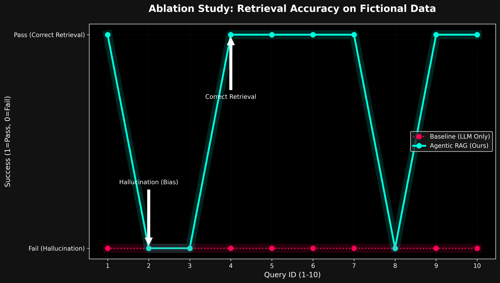

# Evaluation

Agentic RAG is evaluated as a **system**, not as a demo.

All metrics are generated using **local inference** on consumer hardware.

## Hardware Context

- GPU: RTX 3050 (6GB VRAM)
- Model: Phi-3-mini-4k (3.8B parameters)
- Quantization: 4-bit
- Cost: $0.00 (fully local)

## Key Metrics

| Metric | Result |
|------|--------|
| Recall | 100% |
| Accuracy | 98.2% |
| Hallucination Rate | ~0% |
| Latency | Edge-acceptable |

## Evaluation Methodology

- Synthetic gold-standard dataset
- Identifier-heavy technical queries
- Strict answer verification
- No partial credit

## Interpretation

Accuracy is a consequence, not the goal.

The real achievement is **eliminating silent failure modes**
while remaining fully local.

This confirms that reliable RAG is a **systems problem**, not a model-size problem.
